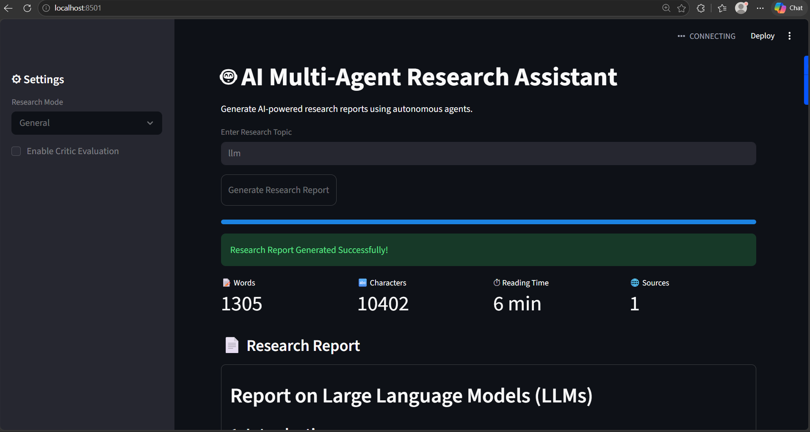
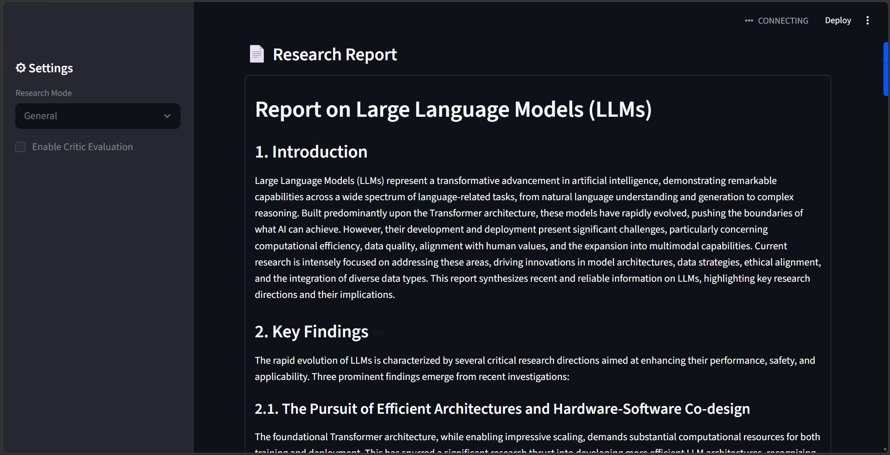
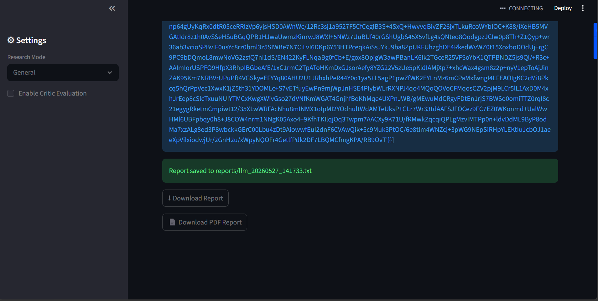

# 🤖 AI Multi-Agent Research Assistant

An AI-powered research assistant built using LangChain, Gemini API, Tavily Search, BeautifulSoup, and Streamlit.

---

## Features

* Multi-agent AI workflow
* Web research automation
* Intelligent webpage scraping
* AI-generated research reports
* PDF & TXT export
* Research modes
* Source visualization
* Analytics dashboard
* Modern Streamlit UI

---

## Technologies Used

* Python
* Streamlit
* LangChain
* Gemini API
* Tavily API
* BeautifulSoup
* FPDF
* GitHub

---

## Setup Instructions

Install dependencies:

```bash
pip install -r requirements.txt
```

Run the project:

```bash
streamlit run app.py
```

---

## Project Structure

```bash
AI-Multi-Agent-Research-Assistant/
│
├── app.py                 # Streamlit frontend UI
├── pipeline.py            # Main multi-agent workflow pipeline
├── agents.py              # AI agents and LLM chains
├── tools.py               # Web search and scraping tools
├── requirements.txt       # Project dependencies
├── README.md              # Project documentation
├── .gitignore             # Ignored files and folders
│
├── screenshots/           # Project screenshots
│   ├── Homepage.png
│   ├── report.png
│   └── pdf.png
```

---

## Screenshots

### Homepage



---

### Generated Report



---

### PDF Export



---

## Future Improvements

* Voice input support
* PPT generation
* Fact-checking agent
* Multimodal research assistant
* Cloud deployment enhancements

---

## Author

**Parth Dobhada**

B.Tech ENTC Student | AI & ML Enthusiast | Embedded Systems | Python Developer
